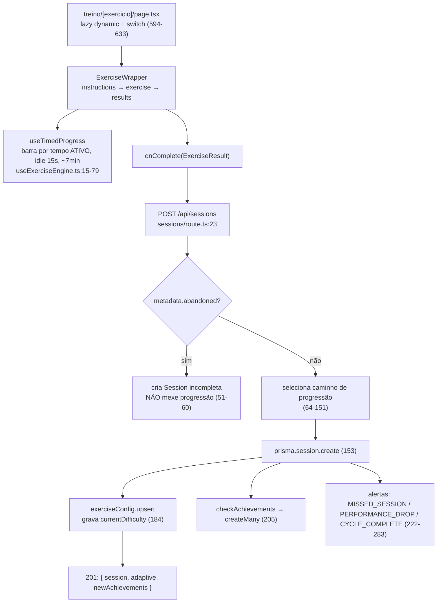
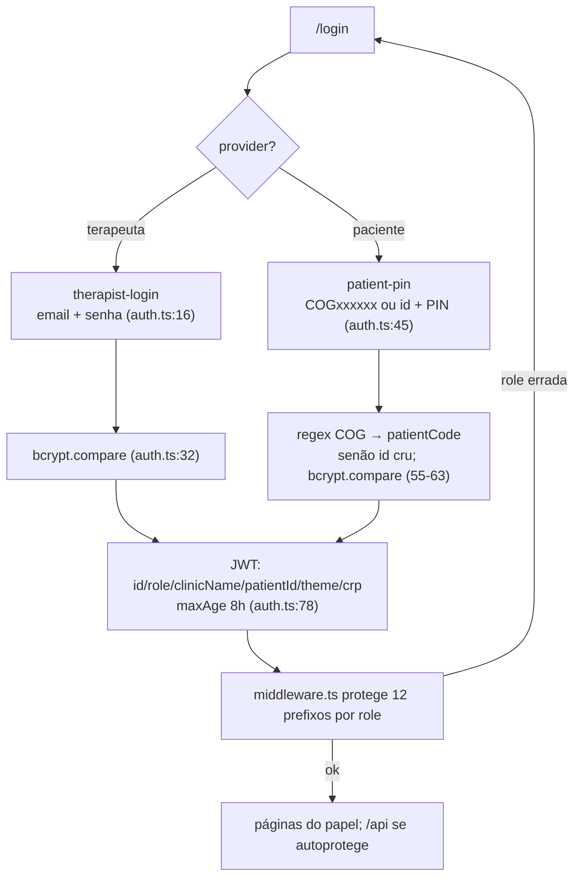
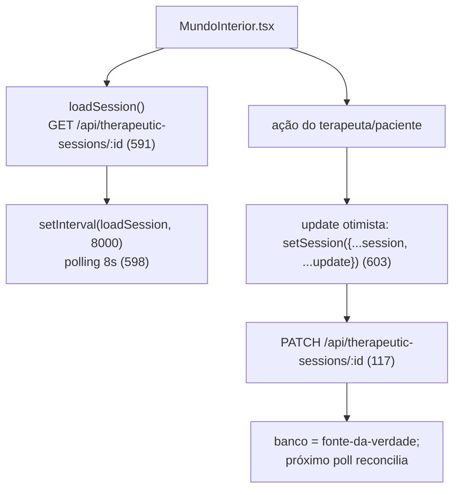

# Arquitetura do NeuroPeak

> Documento técnico derivado do código-fonte. Referências no formato `arquivo:linha`
> apontam para o estado medido em 2026-07-10 (versão 2.11.1).

## 1. Visão geral

O NeuroPeak é uma plataforma web de treino cognitivo clínico para neuropsicólogos em
prática solo: o terapeuta gerencia pacientes, prescreve planos e acompanha evolução; o
paciente executa exercícios gamificados. A aplicação é um monólito Next.js (App Router)
com renderização mista Server/Client Components, banco PostgreSQL via Prisma e
autenticação por credenciais (NextAuth v4, JWT). Não há microsserviços nem fila; toda
lógica de progressão e scoring roda no servidor Next dentro de rotas de API.

**Stack medida (`package.json`):**

| Camada | Tecnologia | Versão |
|--------|-----------|--------|
| Framework | Next.js (App Router) | declarado `^15.3.9`; instalado 15.5.18 |
| UI | React | `^18` |
| Linguagem | TypeScript | `^5` (strict) |
| ORM / DB | Prisma / PostgreSQL (Supabase) | `^5.18.0` |
| Auth | NextAuth | `^4.24.7` |
| PDF | `@react-pdf/renderer` | `^3.4.4` |
| Estilo | Tailwind CSS + Radix UI | — |
| Deploy | Vercel (cron em `vercel.json`) | — |

Tamanho aproximado: ~40.8k linhas TS/TSX (medido em `app components lib types data`;
a medição bruta incluindo `scripts`/`prisma` chega a ~42,6k).

---

## 2. Mapa de camadas e módulos

### `app/` — rotas (App Router, grupos por papel)

| Caminho | Responsabilidade |
|---------|------------------|
| `app/layout.tsx` | Layout raiz: Providers + Toaster + tema |
| `app/page.tsx` | Redireciona para `/dashboard` ou `/inicio` conforme role |
| `app/(auth)/` | `login`, `cadastro`, `recuperar-senha`, `nova-senha` (público) |
| `app/(therapist)/` | Rotas THERAPIST: `dashboard`, `pacientes`, `treino-cognitivo`, `relatorios`, `mundo-interior`, `configuracoes`, `admin` |
| `app/(patient)/` | Rotas PATIENT: `inicio`, `treino`, `progresso`, `jornada`, `bichinho` |
| `app/(patient)/treino/[exercicio]/page.tsx` | Roteador do exercício: `dynamic()` lazy + `switch` de renderização |
| `app/api/` | 22 rotas de API (`route.ts`); ver §5 |
| `app/error.tsx` / `app/global-error.tsx` | Boundaries de erro |

### `components/` — UI e engine

| Subpasta | Responsabilidade |
|----------|------------------|
| `components/exercises/<domínio>/` | 39 arquivos `.tsx` de exercício organizados por domínio (`memory`, `attention`, `executive`, `processing`; `functional` não tem pasta própria — seus 2 exercícios ficam sob outros domínios) |
| `components/exercises/ExerciseWrapper.tsx` | Casca das fases `instructions → exercise → results`; `ProgressContext` |
| `components/exercises/useExerciseEngine.ts` | Hooks `useTimedProgress` (barra por tempo ATIVO) e `useAdaptiveLevel` (dificuldade intrassessão) |
| `components/exercises/PresentationConfig.tsx` | Seletor "Configurar atividade" (modos visual/auditivo) |
| `components/ui/` | Primitivas de interface (Radix + Tailwind) |
| `components/plano/` | Montagem de plano de treino (DomainSelector, subdomínios) |
| `components/patient/` | Telas do paciente (home, progresso, conquistas) |
| `components/dashboard/` | Visão do terapeuta sobre pacientes |
| `components/therapeutic/MundoInterior.tsx` | Sessão terapêutica gamificada (polling + otimista); ver §6c |
| `components/theme/` | `ThemeProvider` e alternância de tema |
| `components/characters/` | Personagens/roster (Focus Agentes e afins) |
| `components/charts/` | Gráficos de evolução |
| `components/gamification/` | Elementos de XP/jornada/conquista |
| `components/reports/` | (pasta com pendência — ver ARQ-009) |

### `lib/` — lógica de domínio (server-first)

| Arquivo | Responsabilidade |
|---------|------------------|
| `lib/auth.ts` | `authOptions` do NextAuth (2 providers Credentials) |
| `lib/auth-helpers.ts` | Guards de rota (`requireAuth`/`requireTherapist`/`requireVerifiedCrp`) + `safeSecretCompare` |
| `lib/api-handler.ts` | `withApiHandler` — wrapper de erro/logging das rotas |
| `lib/db.ts` | Cliente Prisma singleton |
| `lib/adaptive.ts` | Engine de progressão (5 funções) + `checkAchievements` |
| `lib/scoring.ts` | Score por exercício/domínio, aderência, tendência, recomendações |
| `lib/domain-taxonomy.ts` | Taxonomia Domínio → Subdomínio → Exercícios |
| `lib/exercise-meta.ts` | Metadados de exercício (3ª fonte — ver ARQ-001) |
| `lib/exercise-science.ts` / `exercise-functional.ts` | Bibliotecas de conhecimento (somente leitura) |
| `lib/pet.ts` / `lib/skilltree.ts` | Estado de pet e skill tree — **só em localStorage** (ver ARQ-002) |
| `lib/supabase.ts` | Cliente Supabase Storage (documentos CRP) |
| `lib/mailer.ts` | Emails transacionais (Gmail) |
| `lib/tts.ts` / `voicePrefs.ts` | Text-to-speech / preferências de voz |

### `data/` — catálogos estáticos

`agents.ts`, `agentAttributes.ts`, `commandTemplates.ts` (Focus Agentes);
`historias.ts` (Ordem da História); `compra-*.ts` (compras contextuais);
`tts-manifest.ts` (áudios pré-gerados).

### `types/` — contratos

`types/index.ts`: `Domain`, `Theme`, `ExerciseResult`, `EXERCISE_DEFINITIONS`
(39 exercícios), `DOMAIN_LABELS/COLORS/DESCRIPTIONS`.

### `prisma/`

`prisma/schema.prisma` (156 linhas): 10 modelos; ver §3.

---

## 3. Modelo de dados (Prisma)

Fonte: `prisma/schema.prisma`. PostgreSQL com `directUrl` para migrations.

| Modelo | Campos-chave | Relações / `onDelete` |
|--------|--------------|-----------------------|
| `User` | `email` unique, `password` (bcrypt), `role` default `THERAPIST`, `patientLicenses` default `-1` (= ilimitado), `crp`, `crpStatus` default `unverified` | `patients` (1-N), `therapeuticSessions` (1-N) |
| `Patient` | `pin` (bcrypt), `patientCode` unique, `theme` default `CLINICAL`, `birthDate`, dados clínicos | `therapist` → `User` **onDelete: Restrict**; filhos em Cascade |
| `TrainingPlan` | `domains`, `exercises` (strings), `frequency` default 3, `isActive` | `patient` → **Cascade** |
| `Session` | `exerciseId`, `domain`, `score`, `accuracy`, `reactionTime?`, `difficulty`, `duration`, `metadata?` (JSON string) | `patient` → **Cascade** |
| `ExerciseConfig` | `currentDifficulty` default 1, `totalAttempts`, `lastAttemptAt` | `patient` → **Cascade**; `@@unique([patientId, exerciseId])` |
| `Achievement` | `type`, `title`, `description`, `icon`, `unlockedAt` | `patient` → **Cascade** |
| `Alert` | `type`, `message`, `isRead` | `patient` → **Cascade** |
| `LicenseCode` | `code` unique, `licenses`, `usedByTherapistId?` | — (sem relação declarada) |
| `PasswordResetToken` | `token` unique, `userId`, `expiresAt`, `used` | — (sem relação declarada) |
| `TherapeuticSession` | `status`, `phase`, `characterData`/`unlockedTools`/`completedRegions`/`responses` (Json), `therapistNotes` | `patient` → **Cascade**; `therapist` → **Cascade** |

**Observação — 3 CHECK fora do schema:** o `schema.prisma` não declara constraints
`CHECK`; as três validações de `Session` (faixas de `score`/`accuracy`/`difficulty`)
são aplicadas diretamente por SQL no banco e não aparecem no schema nem em arquivos
`.sql` do repositório. Divergência a considerar em qualquer `prisma db push`.

---

## 4. Autenticação e autorização

### Providers e sessão (`lib/auth.ts`)

- Estratégia **JWT**, `maxAge = 8h` (`lib/auth.ts:7-10`). **Sem `PrismaAdapter`** —
  o token é a única fonte de sessão.
- Provider **`therapist-login`** (`lib/auth.ts:16-44`): email + senha, `bcrypt.compare`
  (hashes gravados com custo 12 no registro, `app/api/auth/register/route.ts:35`).
- Provider **`patient-pin`** (`lib/auth.ts:45-75`): entrada `COGxxxxxx`
  (`/^COG\d{4,6}$/` → busca por `patientCode`) ou `id` cru; valida `pin` por
  `bcrypt.compare`. Injeta `email` sintético `patient_<id>@neuropeak.local`.
- Callbacks (`lib/auth.ts:77-100`): o JWT carrega `id` (via `token.sub`), `role`,
  `clinicName`, `patientId`, `theme`, `crp`; propagados para `session.user`.

### Middleware vs. autoproteção de `/api`

- **`middleware.ts`** protege **12 prefixos** de página por role via `withAuth`
  (`middleware.ts:50-64` matcher). Terapeuta: `/dashboard`, `/pacientes`,
  `/relatorios`, `/treino-cognitivo`, `/mundo-interior`, `/configuracoes`, `/admin`.
  Paciente: `/inicio`, `/treino`, `/progresso`, `/jornada`, `/bichinho`. Não-autorizado
  é redirecionado para `/login`. O `else if` do bloco de paciente é intencional:
  `/treino-cognitivo` é superset de `/treino` (`middleware.ts:24-39`).
- **O middleware NÃO cobre `/api`** (fora do matcher). Cada rota se autoprotege:
  - Sessão via `getServerSession(authOptions)` ou os guards de `lib/auth-helpers.ts`
    (`requireAuth` → 401; `requireTherapist` → 401 se role ≠ THERAPIST;
    `requireVerifiedCrp` → 401/403 se CRP não `verified`).
  - Segredos por header comparados com `safeSecretCompare` (`lib/auth-helpers.ts:93-104`):
    `timingSafeEqual` e **fail-closed** (env ausente → `false`, nunca autoriza).

### Isolamento multi-tenant

Mesmo autenticado, o terapeuta só acessa/grava dados de pacientes seus: as rotas
checam `prisma.patient.findFirst({ where: { id, therapistId } })` antes de escrever
(ex.: `app/api/sessions/route.ts:41-47`, `therapeutic-sessions/route.ts:19-23`).

### Matriz de acesso

| Ator | Como se autentica | Alcance |
|------|-------------------|---------|
| **THERAPIST** | `therapist-login` (JWT) | Páginas do grupo terapeuta + rotas de API com `requireTherapist`; apenas pacientes próprios |
| **PATIENT** | `patient-pin` (JWT) | Páginas do grupo paciente + `/api/sessions` (só o próprio `patientId`) e leitura de sua `TherapeuticSession` |
| **Admin (por segredo)** | `ADMIN_SECRET` no header | `POST /api/admin/backfill-codes` (não é role; é segredo fail-closed) |
| **Cron** | `CRON_SECRET` Bearer | `GET /api/cron/check-alerts` (agendado pela Vercel) |
| **THERAPIST + CRP verificado** | `requireVerifiedCrp` | Criação de sessões do Mundo Interior (`POST /api/therapeutic-sessions`) |

Não há papel `ADMIN` no banco: `User.role` só assume `THERAPIST` (pacientes ficam em
`Patient`). "Admin" é um caminho por segredo, não por role.

---

## 5. Superfície de API

22 rotas em `app/api/**/route.ts` (confirmadas abrindo cada arquivo). Auth indica o guard efetivo.

### Auth / conta

| Rota | Método | Auth | O que faz |
|------|--------|------|-----------|
| `/api/auth/[...nextauth]` | GET/POST | NextAuth | Handler do NextAuth (login/logout/sessão) |
| `/api/auth/register` | POST | público | Cria `User` role THERAPIST, senha bcrypt custo 12 |
| `/api/auth/forgot-password` | POST | público | Gera `PasswordResetToken` e envia email |
| `/api/auth/reset-password` | POST | token | Redefine senha via token válido/não-usado |
| `/api/auth/profile` | PATCH | sessão | Atualiza perfil do usuário logado |
| `/api/auth/request-license` | POST | sessão | Solicita licença de paciente |
| `/api/auth/redeem-license` | POST | sessão | Resgata `LicenseCode` (soma licenças ao terapeuta) |

### Pacientes / plano / sessões

| Rota | Método | Auth | O que faz |
|------|--------|------|-----------|
| `/api/patients` | GET/POST | terapeuta | Lista/cria pacientes do terapeuta |
| `/api/patients/[id]` | GET/PATCH/DELETE | terapeuta (dono) | Lê/edita/remove paciente (Cascade nos filhos) |
| `/api/patients/[id]/regenerate-pin` | POST | terapeuta (dono) | Gera novo PIN (bcrypt) |
| `/api/sessions` | POST | paciente/terapeuta | Grava `Session`, roda progressão, conquistas e alertas (ver §6a) |
| `/api/alerts/[id]` | PATCH | terapeuta (dono) | Marca alerta como lido (`isRead=true`) |
| `/api/reports` | GET | terapeuta | Gera PDF de relatório (`@react-pdf/renderer`, `Content-Type: application/pdf`) |

### CRP / verificação

| Rota | Método | Auth | O que faz |
|------|--------|------|-----------|
| `/api/crp-verification` | POST/PATCH/GET | terapeuta | Submete/atualiza/consulta dados de CRP |
| `/api/crp-verification/document` | GET | terapeuta | URL/stream do documento CRP (Supabase Storage) |
| `/api/crp-verification/status` | GET | sessão | Status de verificação do CRP |

### Mundo Interior (sessões terapêuticas)

| Rota | Método | Auth | O que faz |
|------|--------|------|-----------|
| `/api/therapeutic-sessions` | POST | CRP verificado | Cria sessão (pausa a ativa em transação) |
| `/api/therapeutic-sessions` | GET | sessão | Terapeuta: sessões ativas/por paciente; Paciente: sua ativa |
| `/api/therapeutic-sessions/[id]` | GET/PATCH | sessão | Lê/atualiza estado da sessão (fase, região, notas) |

### Operação / infra

| Rota | Método | Auth | O que faz |
|------|--------|------|-----------|
| `/api/cron/check-alerts` | GET | `CRON_SECRET` | Cria `MISSED_SESSION` para pacientes sem sessão há 7 dias |
| `/api/admin/backfill-codes` | POST | `ADMIN_SECRET` | Backfill de `patientCode` (manutenção) |
| `/api/health` | GET | público | Health check |
| `/api/version` | GET | público | Versão do app |

---

## 6. Fluxos de dados principais

### 6a. Paciente joga → sessão salva → progressão → alertas

Da conclusão do exercício até a persistência e efeitos colaterais.

- **Passos:** o `switch` (`app/(patient)/treino/[exercicio]/page.tsx:594-633`) monta o
  componente lazy; `ExerciseWrapper` (`components/exercises/ExerciseWrapper.tsx:12,45`)
  controla as fases e expõe `ProgressContext`; ao terminar chama `onComplete`, que faz
  `POST /api/sessions`. A rota valida com Zod, checa tenant, escolhe a progressão,
  grava `Session` e `ExerciseConfig`, avalia conquistas e emite/limpa alertas.
- **Barra de progresso:** `useTimedProgress` só acumula tempo com interação nos últimos
  15s (`useExerciseEngine.ts:16,52`); saltos de 10%, alvo ~7min.

### 6b. Autenticação dual

### 6c. Mundo Interior (polling + update otimista)

- Estado **100% no banco** (`TherapeuticSession`, campos `Json`); o client aplica a
  mudança na UI antes da confirmação (otimista) e o polling de 8s reconcilia. Criação
  restrita a terapeuta com CRP `verified` (`requireVerifiedCrp`), e cria em transação
  pausando a sessão ativa anterior (`therapeutic-sessions/route.ts:26-46`).

---

## 7. Engine adaptativa e scoring

### Progressão (server-side, `lib/adaptive.ts` orquestrada por `app/api/sessions/route.ts`)

A rota escolhe **um** caminho por sessão (`sessions/route.ts:64-182`):

1. **`calculateDualTaskProgression`** (`dual-task`): exige **as duas** tarefas ≥80% e
   total ≥85% para subir; controla falsos positivos/omissões; mantém `consolidatedLevel`
   (maior nível executado com desempenho suficiente). `-2` só se total <45%.
2. **`calculateStoryTrailProgression`** (`ordem-historia`, `progressionV2`): trilha de
   estágios em `difficulty` (1-10 ordenar, 11 Encontre o Intruso, 12 Descubra); libera o
   próximo estágio com ≥80% e regride ao errar muito.
3. **`calculateProgression`** (genérica, exercícios com `metadata.progressionV2`):
   sobe ≥85% (com dimensões ≥80% e sem impulsividade), mantém 65-85%, desce <65%,
   `-2` se <45%; `consolidatedLevel` só com ≥80%.
4. **`calculateNewDifficulty`** (legado, demais exercícios): média de precisão das
   **últimas 5 sessões daquele exercício** (dentro das 20 mais recentes buscadas);
   sobe >85%, desce <60%, mantém no meio; passo ±1, faixa 1-10.

Em todos, o resultado grava `ExerciseConfig.currentDifficulty` (`sessions/route.ts:184`).
Além disso, **Focus Agentes** (`focus-agents[-auditivo]`) tem progressão **por modo**
via `calculateFocusProgression` (`adaptive.ts:132`), cujo nível vive no `metadata` da
sessão (não no `ExerciseConfig`): ≥80% sobe, <55% desce, faixa 1-9.

**O que decide subir/manter/descer:** precisão (`accuracy`/`accTotal`) contra limiares
por caminho; a maioria exige consolidação de subcomponentes (dimensões, duas tarefas)
e penaliza impulsividade/omissão antes de promover o nível.

### Scoring (`lib/scoring.ts`)

- `calculateExerciseScore`: `100 × accuracy`, com bônus de velocidade (tabela
  `EXPECTED_REACTION_TIMES`) e multiplicador de dificuldade; normaliza 0-100.
- `calculateDomainScore`: média por domínio — cobre **apenas 4 domínios**
  (`memory`, `attention`, `processing`, `executive`); **`functional` não pontua**
  (`scoring.ts:63`).
- `calculateAdherence`, `calculateTrend`, `generateRecommendations`: aderência,
  tendência up/down/stable e recomendações textuais.

**Não implementado:** não há cálculo de **percentil** nem `NORMATIVE_BENCHMARKS` no
código. O tipo `NormativeBenchmark`/`DomainScore.percentile` existe em
`types/index.ts:17,30`, mas **nenhuma função o preenche**. Relatórios e telas usam
apenas score bruto por domínio.

---

## 8. Decisões arquiteturais

Resumo; detalhamento e trade-offs devem viver em `docs/` (ADR por decisão, quando criados).

- **App Router (Next.js 15) monolítico** — Server Components por padrão, `"use client"`
  só quando necessário; exercícios como Client Components lazy-loaded.
- **Prisma + PostgreSQL (Supabase)** — banco relacional único; Supabase usado também
  para Storage (documentos CRP). Sem uso do client Supabase para queries.
- **NextAuth v4 JWT sem `PrismaAdapter`** — sessão stateless de 8h; dois providers
  Credentials (terapeuta/paciente) em vez de OAuth.
- **Progressão no servidor** — decisão de dificuldade centralizada em `lib/adaptive.ts`
  na rota `/api/sessions`, para calibração clínica consistente e à prova de manipulação.
- **Banco como fonte-da-verdade + localStorage como cache** — `Session`/`ExerciseConfig`
  no banco; `localStorage` guarda cache de UI (`np_session_<data>`, `np-focus-day`).
  **Exceção:** pet e skill tree vivem só em `localStorage` (ver §9).
- **PDF no servidor** — `@react-pdf/renderer` em `serverExternalPackages`
  (`next.config.js:38`); relatórios gerados via `GET /api/reports`.
- **Cabeçalhos de segurança + CSP** — CSP com `frame-ancestors 'none'` mas
  `unsafe-inline`/`unsafe-eval` em `script-src` (exigência de hidratação do App Router,
  `next.config.js:9-21`).

---

## 9. Riscos arquiteturais conhecidos

A auditoria completa vive em `docs/DIVIDA-TECNICA.md` (não reproduzida aqui). Ponteiros
por ID:

- **ARQ-001** — Metadados de exercício triplicados e divergentes entre três fontes de
  verdade: `types/index.ts` (`EXERCISE_DEFINITIONS`), `lib/domain-taxonomy.ts` e
  `lib/exercise-meta.ts`. Ex.: `caca-item-barato` é `attention` nas definições e
  `functional` na taxonomia.
- **ARQ-002** — Estado de **pet** (`lib/pet.ts`) e **skill tree** (`lib/skilltree.ts`)
  persistido **só em `localStorage`**, sem espelho no banco: perda silenciosa ao trocar
  de aparelho.
- **ARQ-003 / ARQ-004** — Exercício **órfão** `desafio-cidade` (renderiza no `switch`,
  mas é filtrado do catálogo/planos) e **id fantasma** `atencao-dividida` (referenciado
  em `lib/domain-taxonomy.ts:26` e no filtro de planos, sem definição em
  `EXERCISE_DEFINITIONS` nem `case` de renderização; existe um **componente órfão**
  `AtencaoDividida.tsx` no repositório, mas não está ligado ao roteador).
- **ARQ-007** — **God files** crescentes: `FocusAgents.tsx`, `DesafioCidade.tsx`,
  `Labirinto.tsx` e o roteador `treino/[exercicio]/page.tsx` (switch de 39 casos +
  tabelas de instruções, forçando registro do exercício em vários lugares — ver
  também ARQ-006).

Consultar `docs/DIVIDA-TECNICA.md` para os demais itens (ARQ-005, 006, 008, 009) e
para severidade/plano de cada um.
